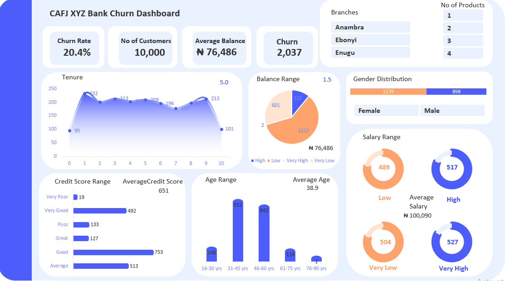
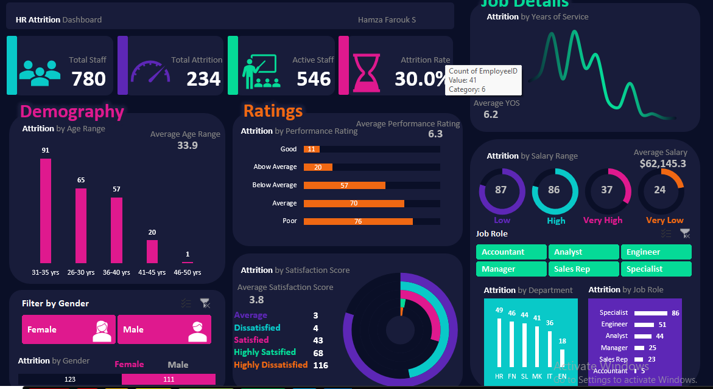

<!--Section 1: Introduce your self-->
## ABOUT ME

Hello! I'm Hamza Farouk Stephen 🤓, a freelance Data Analyst with a strong command of Microsoft Excel and Power BI. I specialize in transforming raw data into clear, actionable insights that help businesses make smarter decisions. Whether it’s building dashboards or analyzing trends, I approach every task with focus and determination to deliver my best work.

I’m also highly receptive to feedback—criticism doesn’t discourage me; it helps me grow. My goal is always to improve, adapt, and ensure the final result exceeds expectations.

<!--Mention your top/relevant skills here - core and soft skills-->
## WHAT I DO

*As a freelance Data Analyst, I offer consulting services to businesses and help them make sense of their data using Excel and Power BI.*

**- ✅ Data Cleaning & Preparation.**
I organize and structure messy data to make it analysis-ready. 

**- ✅ Data Visualization.**
I build interactive dashboards and visuals using Power BI to highlight trends and insights clearly.

**- ✅Reporting & Analysis.**
I generate reports and extract key insights to support decision-making.

**- ✅ Excel-Based Solutions.**
I create automated reports, models, and tools using advanced Excel features (formulas, pivot tables, charts, etc).

<!--Section 2: List 3-4 key projects-->
## MY PORTFOLIO 

*A glimpse of some of the projects I've been working on.*

**Predictive Modeling and Hypothesis Testing using Titanic Dataset.**

The sinking of the Titanic is one of the most infamous shipwrecks in history.

[Read More](https://www.linkedin.com/pulse/predictive-modeling-hypothesis-testing-using-titanic-dataset-anietie/)

**Predictive Modeling and Hypothesis Testing using Titanic Dataset.**

On April 15, 1912, during her maiden voyage, the widely considered “unsinkable” RMS Titanic sank after colliding with an iceberg. 

[Read More](https://www.linkedin.com/pulse/predictive-modeling-hypothesis-testing-using-titanic-dataset-anietie/)

**Predictive Modeling and Hypothesis Testing using Titanic Dataset.**

Unfortunately, there weren’t enough lifeboats for everyone onboard, resulting in the death of 1502 out of 2224 passengers and crew. 

<a href="17 How to Present Data to Executives by Anietie Etuk.pdf">Download the Report here (pdf file)</a>

## CONTACT DETAILS

*Let’s connect and see how we can make a difference together!*
<table>
  <tbody>
    <tr>
      <td>📧</td>
      <td><a href="mailto:hamzafarouk2004@gmail.com">hamzafarouk2004@gmail.com</a></td>
    </tr>
    <tr>
      <td>📞</td>
      <td>(234) 703-463-9856</td>
    </tr>
    <tr>
      <td>📍</td>
      <td>Fct.ABJ, Nigeria</td>
    </tr>
    <tr>
      <td>⬇️</td>
      <td><a href="https://etuk123456.github.io/portfolio1/docs/Profile.pdf">Download my CV</a></td>
    </tr>
    <tr>
      <td>🌐</td>
      <td><a href="https://linkedin.com/in/etukanietie">The things I do daily on LinkedIn</a></td>
    </tr>
    <tr>
      <td>📺</td>
      <td><a href="https://www.youtube.com/@LearnwithEtuk">Watch my tutorials on YouTube</a></td>
    </tr>
  </tbody>
</table>
